# mikrotik-ipsec-lab

A hands-on lab that builds two isolated sites on MikroTik RouterOS, connects them with a site-to-site IPsec VPN, and then locks the perimeter down. Written up as a case study, including the things that broke along the way.

Two remote-access designs are built and compared:

| | Approach A: RDP over NAT | Approach B: RDP over IPsec |
|---|---|---|
| Mechanism | `dst-nat` port forward on the WAN edge | Encrypted tunnel between sites |
| Client connects to | `10.0.0.2` (public/WAN address) | `192.168.20.10` (private address) |
| Exposure | Port 3389 open to anything reaching the WAN | Nothing exposed; tunnel-only |
| Traffic | Cleartext | Encrypted (AES-256 / SHA-256) |
| Final state | **Disabled** | **Active** |

Approach A was built first, verified working, and then deliberately retired in favour of B. The reasoning behind that decision is the core of this write-up.

---

## Table of contents

- [Topology](#topology)
- [Environment](#environment)
- [Phase 1: Base configuration](#phase-1-base-configuration)
- [Phase 2: Approach A, RDP over NAT](#phase-2-approach-a-rdp-over-nat)
- [Phase 3: Approach B, site-to-site IPsec](#phase-3-approach-b-site-to-site-ipsec)
- [Phase 4: Firewall hardening](#phase-4-firewall-hardening)
- [Troubleshooting log](#troubleshooting-log)
- [Key takeaways](#key-takeaways)
- [Known gaps / next steps](#known-gaps--next-steps)

---

## Topology

```
        SITE A                    "INTERNET"                    SITE B
  192.168.10.0/24                10.0.0.0/24               192.168.20.0/24

 ┌──────────────┐                                          ┌──────────────┐
 │  Windows-1   │                                          │  Windows-2   │
 │ .10          │                                          │ .10          │
 └──────┬───────┘                                          └───────┬──────┘
        │ VMnet2                                            VMnet3 │
 ┌──────┴───────┐        ┌────────────────┐         ┌──────────────┴─────┐
 │  MikroTik-1  │ ether1 │     VMnet4     │  ether1 │     MikroTik-2     │
 │ ether2 .1    ├────────┤   (WAN link)   ├─────────┤ ether2 .1          │
 │      10.0.0.1│        └────────────────┘         │10.0.0.2            │
 └──────────────┘                                   └────────────────────┘
                     ═══════════════════════════
                      IPsec tunnel (IKEv2/ESP)
                    192.168.10.0/24 ⟷ 192.168.20.0/24
```

### Addressing

| Device | Interface | Address | Role |
|---|---|---|---|
| MikroTik-1 | ether1 | `10.0.0.1/24` | WAN (site A edge) |
| MikroTik-1 | ether2 | `192.168.10.1/24` | LAN A gateway |
| MikroTik-2 | ether1 | `10.0.0.2/24` | WAN (site B edge) |
| MikroTik-2 | ether2 | `192.168.20.1/24` | LAN B gateway |
| Windows-1 | n/a | `192.168.10.10/24` | Client, site A |
| Windows-2 | n/a | `192.168.20.10/24` | RDP target, site B |

`10.0.0.0/24` stands in for the public internet: it is the only segment both routers share, and neither LAN is reachable from it without explicit configuration.

---

## Environment

- **VMware Workstation** on a Windows host
- **MikroTik RouterOS 6.48.6** (long-term, x86), installed from ISO, ×2
- **Windows 10** ×2
- **WinBox** for GUI configuration, RouterOS CLI for the rest

Four VMware virtual networks, all host-only, no DHCP:

| Network | Subnet | Purpose |
|---|---|---|
| VMnet2 | `192.168.10.0/24` | LAN A |
| VMnet3 | `192.168.20.0/24` | LAN B |
| VMnet4 | `10.0.0.0/24` | Simulated WAN |

Each MikroTik VM has two adapters (WAN + LAN); each Windows VM has one.

> **VM notes:** RouterOS is not in VMware's guest OS list; *Other Linux 2.6.x kernel* works. The VM must use **BIOS** firmware and an **IDE** disk; RouterOS 6.x has no driver for VMware's SCSI/SATA/NVMe controllers and the installer will report *no harddrives found*. 1-2 GB of disk and 128-256 MB RAM is plenty.

Because *Connect a host virtual adapter to this network* is enabled on each VMnet, the host holds an interface on all three segments, which is what makes it possible to manage both routers from WinBox on the host without a jump box.

---

## Phase 1: Base configuration

RouterOS ships with no addresses and no DHCP client. Everything here is static.

**MikroTik-1**
```
/interface print
/ip address add address=10.0.0.1/24     interface=ether1
/ip address add address=192.168.10.1/24 interface=ether2
```

**MikroTik-2**
```
/ip address add address=10.0.0.2/24     interface=ether1
/ip address add address=192.168.20.1/24 interface=ether2
```

**MikroTik-1**

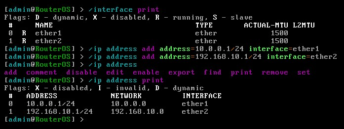

**MikroTik-2**

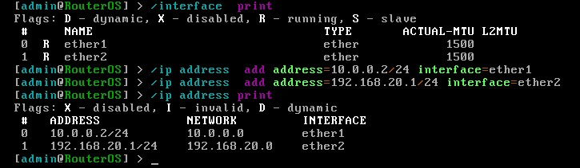

WAN reachability between the two routers, the first checkpoint:

**MikroTik-1 → MikroTik-2**

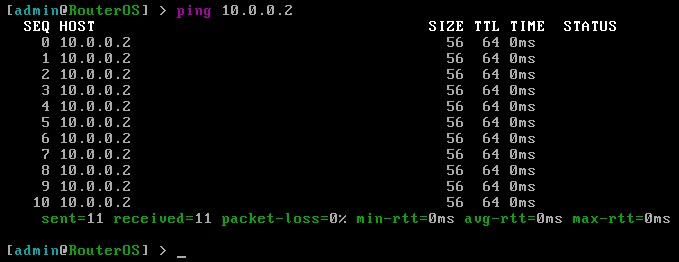

**MikroTik-2 → MikroTik-1**

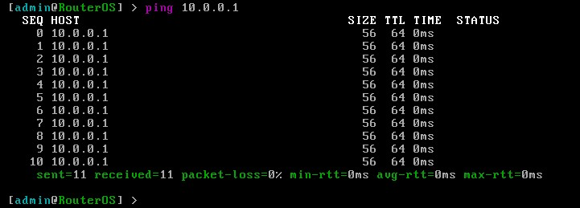

Windows clients, statically addressed with their local router as gateway:

| Windows-1 | Windows-2 |
|---|---|
| 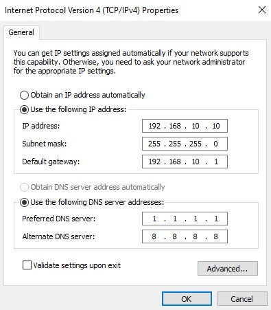 | 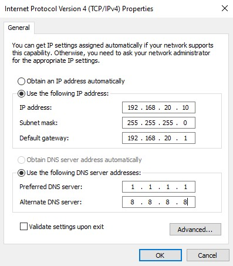 |
| 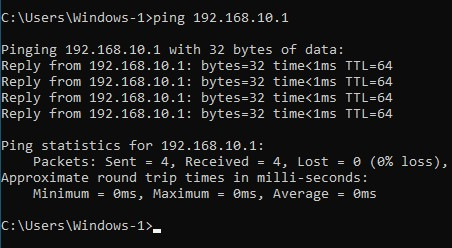 | 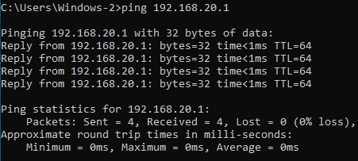 |

Windows Firewall drops inbound ICMP from off-subnet sources by default, which makes end-to-end ping testing useless until it is allowed. Run on both clients:

```
netsh advfirewall firewall add rule name="Allow ICMPv4" protocol=icmpv4:8,any dir=in action=allow
```

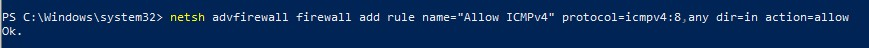

---

## Phase 2: Approach A, RDP over NAT

The classic port-forward: expose a service on the WAN edge and translate it to a private host.

**MikroTik-1**, source NAT so LAN A traffic can leave the site:
```
/ip firewall nat add chain=srcnat out-interface=ether1 action=masquerade \
    comment="Masquerade to WAN"
```

**MikroTik-2**, destination NAT for RDP:
```
/ip firewall nat add chain=dstnat protocol=tcp in-interface=ether1 dst-port=3389 \
    action=dst-nat to-addresses=192.168.20.10 to-ports=3389 \
    comment="DNAT RDP to Windows-2"
```

**MikroTik-1: masquerade only**

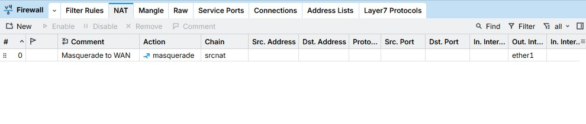

**MikroTik-2: masquerade + DNAT for RDP**

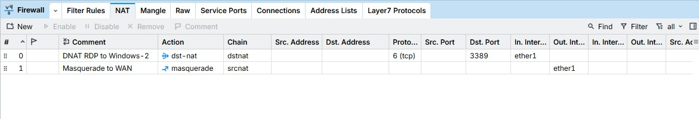

Filter rules at this stage were minimal: established/related plus anything that had been through DNAT:

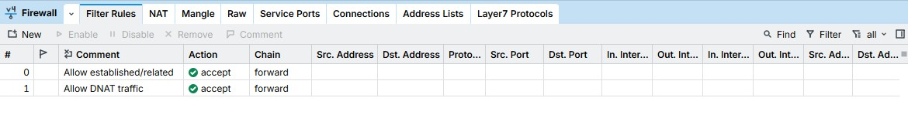

Windows-1 connects to `10.0.0.2`, the router's WAN address, not the target host:

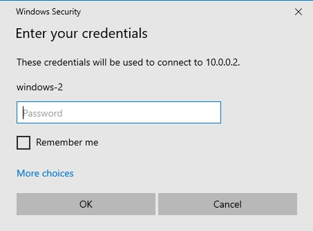


Working, and that is exactly the problem. The DNAT rule matches on interface and port only, with no source restriction. Anything able to reach `ether1` gets a free shot at RDP on the internal host. On a real WAN that means continuous credential stuffing and exposure to protocol-level bugs (BlueKeep being the obvious example). It works, and it should not be used.

---

## Phase 3: Approach B, site-to-site IPsec

**Phase 2 proposal**, identical on both routers:
```
/ip ipsec proposal add name=proposal1 auth-algorithms=sha256 \
    enc-algorithms=aes-256-cbc pfs-group=modp2048
```

**Peer, identity and policy on MikroTik-1**
```
/ip ipsec peer add name=peer-to-mk2 address=10.0.0.2/32 exchange-mode=ike2
/ip ipsec identity add peer=peer-to-mk2 auth-method=pre-shared-key secret="<PSK>"
/ip ipsec policy add src-address=192.168.10.0/24 dst-address=192.168.20.0/24 \
    peer=peer-to-mk2 proposal=proposal1 tunnel=yes
```

**MikroTik-2**, mirrored:
```
/ip ipsec peer add name=peer-to-mk1 address=10.0.0.1/32 exchange-mode=ike2
/ip ipsec identity add peer=peer-to-mk1 auth-method=pre-shared-key secret="<PSK>"
/ip ipsec policy add src-address=192.168.20.0/24 dst-address=192.168.10.0/24 \
    peer=peer-to-mk1 proposal=proposal1 tunnel=yes
```

#### MikroTik-1

**Proposal**

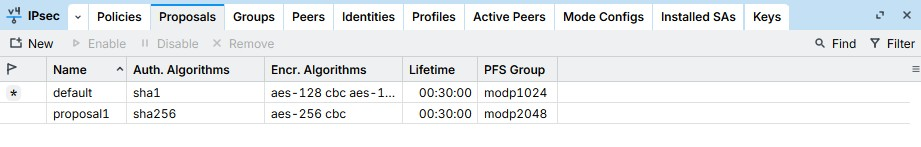

**Profile**

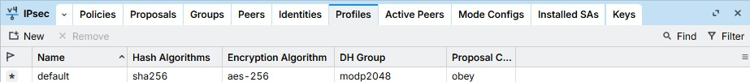

**Peer**

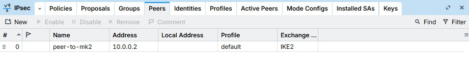

**Identity (PSK)**

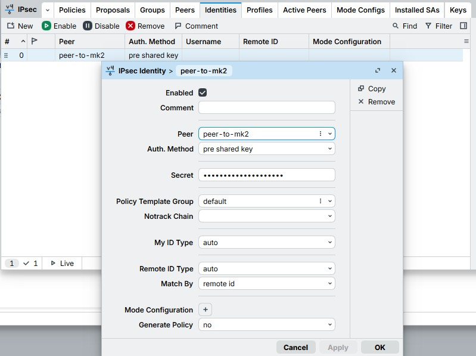

**Policy**

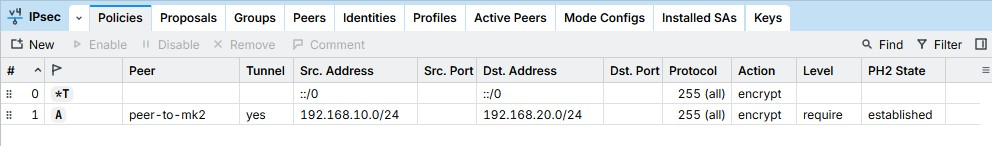

#### MikroTik-2

**Profile**

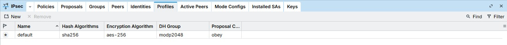

**Peer**

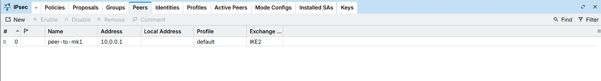

**Identity (PSK)**

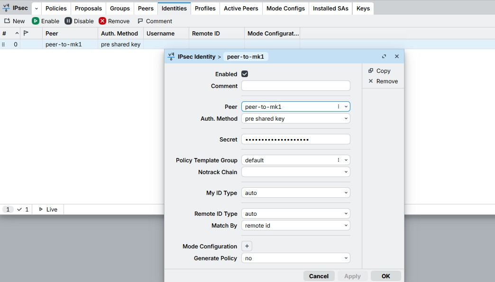

**Policy**

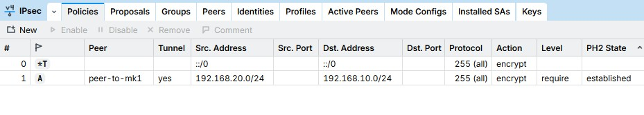

Both policies show `PH2 State: established`.

### The part that isn't obvious

An established tunnel does not create routes. RouterOS matches traffic against IPsec policies as it is being forwarded, so if the router has no route toward the remote subnet, the packet is dropped for being unroutable before policy matching ever happens. Static routes on both sides:

```
# MikroTik-1
/ip route add dst-address=192.168.20.0/24 gateway=10.0.0.2

# MikroTik-2
/ip route add dst-address=192.168.10.0/24 gateway=10.0.0.1
```

**MikroTik-1: note the static `AS` route to 192.168.20.0/24**

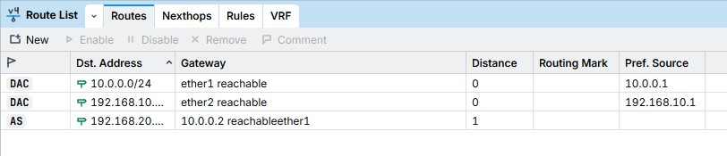

**MikroTik-2: mirrored, static `AS` route to 192.168.10.0/24**

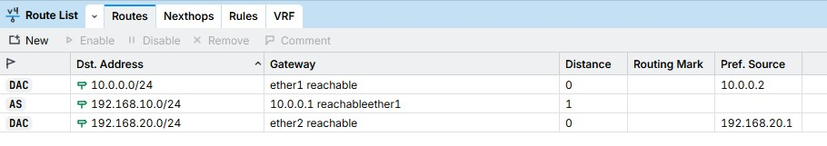

End-to-end, both directions, private addressing throughout:

| Win1 → Win2 | Win2 → Win1 |
|---|---|
| 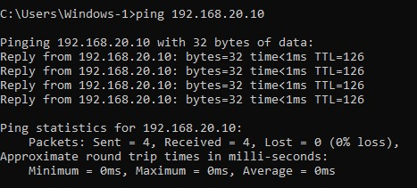 | 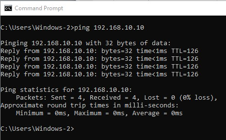 |

RDP now targets the host's real address, with no port forward involved:

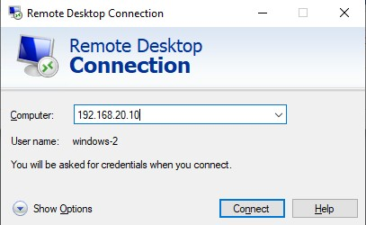


---

## Phase 4: Firewall hardening

Up to this point both routers accepted essentially everything. Two chains needed work.

### `input`: protecting the routers themselves

Without this, WinBox, SSH and the API are reachable from the WAN.

```
/ip firewall filter add chain=input connection-state=established,related action=accept
/ip firewall filter add chain=input in-interface=ether2 action=accept comment="Allow from LAN"
/ip firewall filter add chain=input protocol=udp dst-port=500,4500 action=accept comment="Allow IPSec"
/ip firewall filter add chain=input protocol=ipsec-esp action=accept comment="Allow ESP"
/ip firewall filter add chain=input action=drop comment="Drop everything else to router"
```

> Management is restricted to `ether2` (LAN). Applying a catch-all `input` drop over a remote session will lock you out; always keep console access as a fallback.

### `forward`: restricting what crosses the tunnel

An IPsec tunnel encrypts; it does not filter. Left alone, every host in LAN A can reach every port in LAN B. Only RDP is permitted:

```
/ip firewall filter add chain=forward protocol=tcp src-address=192.168.10.0/24 \
    dst-address=192.168.20.0/24 dst-port=3389 action=accept comment="Allow RDP via VPN only"
/ip firewall filter add chain=forward src-address=192.168.10.0/24 \
    dst-address=192.168.20.0/24 action=drop comment="Drop rest between LANs"
```

### Rule order

RouterOS evaluates top-down and stops at the first match, so a specific `accept` must precede its matching `drop`, and both must precede any broad `accept`. The first attempt had the inter-LAN rules sitting below `established,related`, and they showed **0 bytes / 0 packets**, meaning they were never reached and the restriction was doing nothing. A zero-byte counter on a rule you expect to be busy is the fastest way to spot this.

Reordering by index fails once indices shift; matching on the comment is stable:
```
/ip firewall filter move [find comment="Allow RDP via VPN only"] destination=1
/ip firewall filter move [find comment="Drop rest between LANs"]  destination=2
```

Final `forward` order on MikroTik-2:

```
1  accept  RDP, 192.168.10.0/24 → 192.168.20.0/24 :3389
2  drop    everything else between the two LANs
3  accept  established,related
4  accept  connection-nat-state=dstnat
```

**MikroTik-1: `input` chain only; no inter-LAN forward rules needed on this side**

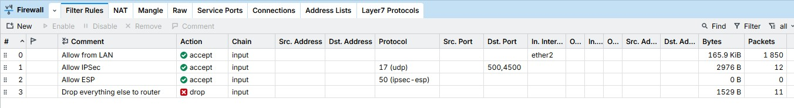

**MikroTik-2: full rule set, `forward` and `input`**

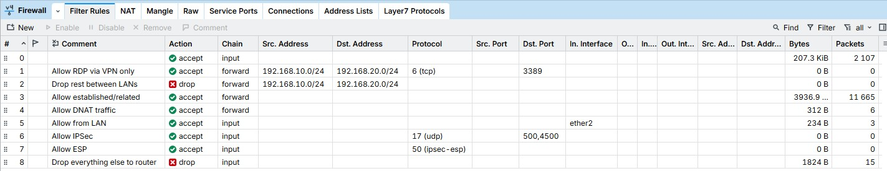

### Retiring Approach A

With everything in place, RDP still answered on the WAN address. Cause: the DNAT rule was still live, and connection tracking tags those sessions `dstnat`, so they were accepted by rule 4 regardless of where the inter-LAN rules sat, because the WAN path never matches `src-address=192.168.10.0/24` in the first place. The two paths were independent, and tightening one did nothing to the other.

```
/ip firewall nat disable [find comment="DNAT RDP to Windows-2"]
```

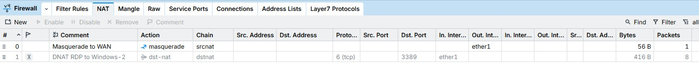

RDP is now reachable only through the tunnel.

---

## Troubleshooting log

Every one of these cost real time. Symptom → cause → fix.

### 1. `FATAL ERROR: no harddrives found`

The RouterOS installer boots fine, then finds no disk. RouterOS 6.x has no driver for VMware's SCSI controller (SATA and NVMe fail the same way). **Fix:** remove the virtual disk and re-add it as **IDE**.

### 2. `EFI Network...` / `Time out`

The VM falls through to PXE boot because no bootable media was found: the CD/DVD device had *Connect at power on* ticked but *Connected* unticked, so it was never attached to the running VM. **Fix:** tick *Connected*, then power-cycle.

### 3. RouterOS has no IP after installation

`/ip address print` returns nothing and WinBox can't reach the router by address. Not a fault: RouterOS has no DHCP client enabled out of the box, and no default addressing. **Fix:** assign statically, or `/ip dhcp-client add interface=ether1 disabled=no`. WinBox's *Neighbors* tab discovers routers by MAC and works before any IP exists.

### 4. Address overlap with the VMware host

VMware assigns the host's virtual adapters the `.1` of each host-only subnet, the same addresses used for the router LAN/WAN interfaces. Worth knowing before diagnosing a management address that stops responding: check for an overlap before blaming the router.

### 5. `Destination net unreachable` from the local gateway

The reply comes from `192.168.10.1`: the router is actively answering *"I have no route"*, not silently dropping. It only knows its two connected subnets. **Fix:** static routes for the remote LAN on both routers.

This is where **routing asymmetry** bites. Outbound works with no extra config because the destination (`10.0.0.2`) is a directly connected network. The *return* packet is addressed to `192.168.10.10`, a network the far router has never heard of, so either both directions need routes, or `srcnat` must rewrite the source so replies come back to an address the far side already knows.

### 6. DNAT rule silently doing nothing

Three faults in one rule:

| Wrong | Right | Why |
|---|---|---|
| `action=accept` | `action=dst-nat` | `accept` permits the packet without translating it |
| `dst-address=192.168.20.10` | `to-addresses=192.168.20.10` | in `dstnat`, `dst-address` **matches** the incoming destination, which is `10.0.0.2`, so the rule never fired |
| `src-port=3389` | *(omit)* | the client's source port is ephemeral, never 3389 |

The rule looked plausible in WinBox and produced no error, but the packet reached the router untranslated and died there.

### 7. RDP refuses accounts with blank passwords

Windows blocks remote logon to passwordless local accounts, regardless of network configuration. **Fix:** set a password (preferred), or disable *Accounts: Limit local account use of blank passwords to console logon only*.

### 8. Ping fails but RDP works

Windows Firewall permits RDP once the feature is enabled but still drops inbound ICMP from other subnets, so connectivity tests fail while the actual service works. Misleading during diagnosis, because it looks like a routing problem. **Fix:** the `netsh` ICMP rule from Phase 1.

### 9. `/ip firewall filter move` → `no such item`

Indices shift after each move, and WinBox's `#` column doesn't map cleanly to CLI indices when chains are interleaved. **Fix:** `move [find comment="..."] destination=N`.

---

## Key takeaways

**A tunnel is not a route.** IPsec policies match traffic that is already being forwarded. No route to the remote subnet means the packet dies before policy matching. Established peers with zero throughput almost always mean a missing route.

**Return paths need as much thought as forward paths.** Half of the failures here were one-directional configs. Either route both ways, or NAT the source so replies target something the far end already knows.

**A tunnel encrypts; it doesn't authorise.** Without `forward` rules, a site-to-site VPN flattens two networks into one. Encryption and access control are separate jobs.

**Rule order is the configuration.** A correct rule in the wrong position is a rule that never runs. Byte/packet counters make this visible in seconds.

**Connection tracking is why NAT'd sessions bypass expectations.** The DNAT path stayed open despite tight inter-LAN rules because it never matched them: different source, different destination, tagged `dstnat` at ingress. Two independent paths to the same host means two independent things to secure.

**Port-forwarding RDP is the anti-pattern.** It works on the first try, which is exactly what makes it dangerous. Approach A took minutes; Approach B took hours. B is the one that ships.

---

## Known gaps / next steps

- **PSK authentication**: fine for a lab, certificates preferred in production
- **No dynamic routing**: static routes don't scale past a handful of sites; OSPF would be the natural next step
- **Client-to-site VPN**, the planned follow-up: an OpenVPN server on the site B router with per-user accounts, matching a real deployment where remote users connect with OpenVPN Connect rather than a router-to-router tunnel
- **No logging or monitoring**: no accounting on drop rules, no syslog
- **RouterOS 6.48.6**: long-term branch; v7 changes IPsec and routing syntax significantly
